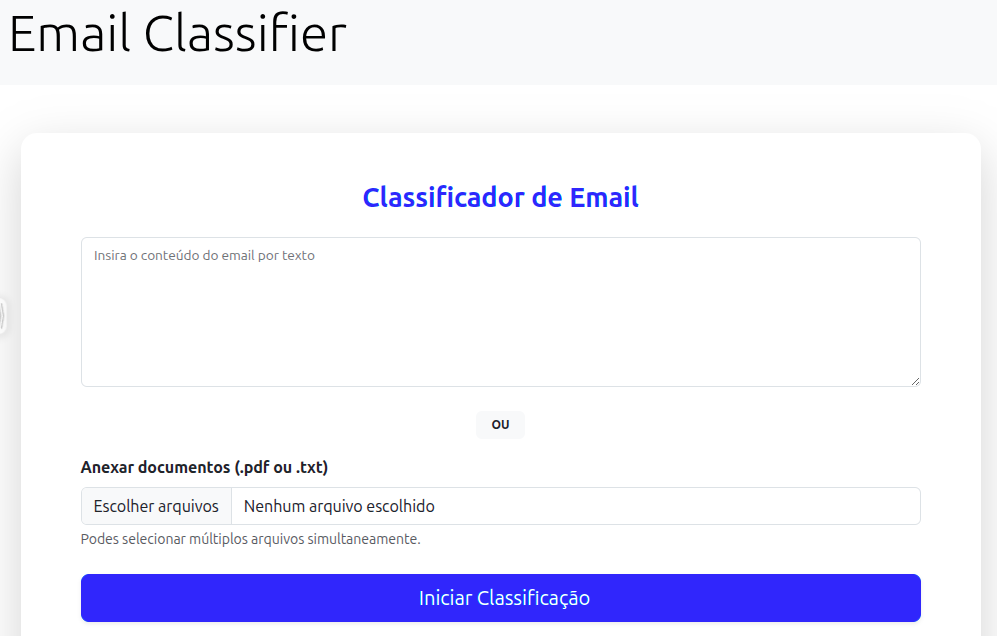

# Email Classifier

Uma solução digital desenvolvida em Django para classificar e-mails (Produtivo vs. Improdutivo) e gerar sugestões de resposta automáticas utilizando modelos de LLM (OpenRouter) gratuitos.


## 1. Demonstração

### Tela Principal


### Resultados da Classificação


## 2. Instalação

Siga os passos abaixo para erguer este projeto em sua máquina local:

1. **Clone o repositório:**
   ```bash
   git clone https://github.com/jotor-dev/email_classifier.git
   cd email-classifier

2. **Crie e ative o ambiente virtual:**
   ```bash
    python -m venv .venv
    source .venv/bin/activate  # Linux
    .venv\Scripts\activate   # Windows
3. **Instale as dependências:**
   ```bash
   pip install -r requirements.txt
4. **Crie um arquivo .env na raiz do projeto baseado no .env_example:**
   ```bash
    cp .env_example .env
5. **Configure suas variáveis de ambiente:**
   ```bash
    API_TOKEN=sua_chave_da_openrouter
6. **Rodar servidor localmente:**
   ```bash
    cd email_classifier
    python manage.py runserver

---

## 3. Funcionalidades

* **Análise de Texto:** Processa textos diretos e documentos PDF.
* **Geração Inteligente:** Sugestões de resposta personalizadas baseadas no tom e conteúdo do e-mail recebido.


## 4. Estrutura do Projeto
- `src/`: Raiz da aplicação Django.
- `src/service`: Lógica principal do upload, tratamento e interação com modelo de IA.
- `src/resources/`: Arquivo CSS.
- `src/templates/`: Onde residem as páginas (HTML) da aplicação.
- `src/files/`: Armazenamento temporário de documentos para análise.

## 5. Licença

Este projeto está sob a licença MIT. Veja o arquivo [LICENSE](LICENSE) para mais detalhes.